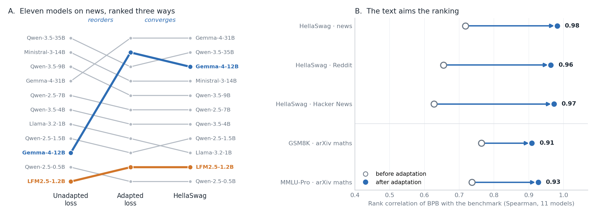

# Back to Entropy: Evaluating Base Language Models Beyond Perplexity and Benchmarks

[](https://github.com/DavidAfonsoValente/entropy-bench/actions/workflows/ci.yml)
[](https://github.com/DavidAfonsoValente/entropy-bench/releases/latest)
[](LICENSE)
[](paper_sota.pdf)

**Evaluate language models as language models.** Every ability a base model has, it learned by
predicting text. Entropy Bench measures exactly that — held-out loss in bits per byte, on fresh,
decontaminated text from the domain of use, after every candidate has been adapted to it the same
way — instead of reading a public scorecard.



*Left: eleven base models ranked by loss on news before adaptation, after adaptation, and by
HellaSwag. Adaptation reorders them — Gemma-4-12B climbs from ninth to second — and the adapted
order runs almost parallel to HellaSwag's. Right: adapted on general text the ranking converges on
HellaSwag on every corpus; adapted on arXiv mathematics it swings to GSM8K and MMLU-Pro.*

**[Read the paper](paper_sota.pdf) · [Start in five minutes](docs/QUICKSTART.md) · [View the
leaderboard](LEADERBOARD.md) · [Understand a result](docs/RESULTS.md) · [Check the
dataset](docs/DATASET.md)**

## Why not the scorecard

**Benchmarks are public.** They were written before the model existed, vendors optimise for the
ones they report, and their content can reach pre-training data, so a high score cannot distinguish a
stronger model from one that saw more of that exam. Llama-3.2-1B and Qwen2.5-1.5B are 2.1 points
apart on HellaSwag and 3.4% apart in adapted bits per byte — and 55.3 points apart on GSM8K.

**Benchmarks score a model before it is adapted.** Teams adapt a base model before they use it, so
what matters is how good it becomes. Gemma-4-12B is thirteenth of fifteen on raw loss and mid-table
on GSM8K and MMLU-Pro; once adapted it is second, and fine-tuned it builds the best system of all.

## Why loss

There is no universal ground truth for which base model is better; a task only says which is better
at that task. Loss is the principled yardstick: every base model was trained to minimise it, and on
shared text the difference between two models' expected losses is exactly the difference in their
KL divergence from the text's distribution. Dividing by UTF-8 bytes rather than tokens puts every
tokenizer on one scale. The protocol adds what makes that usable: text dated after every model
shipped, deduplicated and screened for membership, and the same adaptation for every candidate.

## What it shows

Across seventeen base models (0.5B–35B, eight families) and four corpora:

- **Adaptation reorders the models.** Unadapted and adapted rankings agree only at Spearman
  0.61–0.68. Unadapted loss mixes familiarity with a style of prose into capability: the two Gemmas
  and the Liquid model gain 17–36% from adaptation where every other model gains 3.6–5.4%, and they are
  the only models that climb.
- **The adapted ordering converges on the language benchmark, and can be aimed.** It matches
  HellaSwag at Spearman 0.96–0.98 on news, Reddit and Hacker News, up from 0.63–0.72; adapted on
  arXiv mathematics it swings to GSM8K (0.91) and MMLU-Pro (0.93).
- **It is stable where benchmarks are not.** Seed-to-seed variation is 0.0012× the spread between
  models; cells reproduce across hardware to within 0.0003. The same weights move GSM8K by up to
  0.69 points when only the evaluation host changes.
- **Minutes of adaptation anticipate hours of fine-tuning.** Ranked before any task exists, fifteen
  models land within one rank of where their fine-tuned news systems finish (Spearman 0.99; GSM8K
  0.59, MMLU-Pro 0.71). It is not news predicting news: BPB adapted on Reddit predicts the news
  fine-tune exactly as well as news BPB does.

## The method

Each candidate's adaptation hyperparameters come from its own Optuna search — the same number of
trials for every model, no time cap — and the chosen configuration trains until validation loss
plateaus: `python -m lm_adapt_bench.cli --hparams sweep --no-time-limit`. Searching seventeen models
of up to 35B was beyond this study's compute, so the reported results use the pipeline's other mode,
one hand-picked recipe for every model (`--hparams manual`: LoRA r=16, alpha=32, learning rate 1e-4,
effective batch 32, 250 steps), which costs 3.7 GPU-minutes at 0.5B and about an hour at 31B. Every
number in the paper recomputes from a committed artifact with `make check`.

## Pick your path

| I want to… | Start here | Hardware |
|---|---|---|
| Inspect and verify the published evidence | [Quickstart: path 1](docs/QUICKSTART.md#1-inspect-the-published-results--no-gpu-required) | CPU only |
| Evaluate a model on my own text | [Quickstart: path 2](docs/QUICKSTART.md#2-evaluate-a-base-model-on-your-corpus) | CUDA recommended |
| Add or request a leaderboard model | [Quickstart: path 3](docs/QUICKSTART.md#3-add-a-model-to-the-leaderboard) | None for a request |
| Verify an authorized copy of the paper corpus | [Dataset guide](docs/DATASET.md#verify-an-authorized-copy) | CPU only |
| Understand every result field | [Results guide](docs/RESULTS.md) | None |

## Install

Python 3.10 or newer is required. Install a PyTorch build suitable for your CUDA system first when
necessary.

```bash
git clone https://github.com/DavidAfonsoValente/entropy-bench.git
cd entropy-bench
python -m venv .venv
source .venv/bin/activate
python -m pip install --upgrade pip
python -m pip install -e .
```

Confirm the three public tools are available:

```bash
entropy-bench --help
entropy-dataset --help
entropy-leaderboard --help
```

## Evaluate models on your data

The recommended input is JSONL with one `{"text":"..."}` object per line. TXT, CSV, Hugging Face
datasets saved to disk, and ZIP files are also supported.

Inspect the corpus before allocating a GPU:

```bash
entropy-dataset describe /path/to/domain-corpus.jsonl
```

Start with a zero-shot baseline:

```bash
entropy-bench \
  --models Qwen/Qwen2.5-0.5B meta-llama/Llama-3.2-1B \
  --dataset /path/to/domain-corpus.jsonl \
  --dataset-text-field text \
  --output results/my-domain \
  --contam-check-level strict \
  --contam-cleaning-mode global_unified \
  --baseline-only \
  --no-pdf
```

Remove `--baseline-only` for LoRA adaptation. The zero-shot number costs one forward pass and shows
how much a model already resembles the corpus; the adapted number is the ranking, for the reasons in
[What it shows](#what-it-shows).

Adaptation hyperparameters come from one of two sources, and either way the final adaptation trains
until validation BPB stops improving (early stop on a plateau; with `--phase train` it resumes across
chained jobs, so a job's walltime never cuts it short). On a machine with no job time limit,
`--no-time-limit` runs the full method with no shortcuts: every sweep trial, then training until the
validation plateau with no wall-time budget and no epoch cap; the result records `stop_reason`, and
only `"plateau"` means validation BPB converged.

- `--hparams sweep` (default, the method): a per-model Optuna search — TPE sampler, successive
  halving on validation BPB — with the same `--n-trials` for every model and no wall-time cap, so
  no model is better tuned than another. `--sweep-time-fraction` adds a cap when walltime forces
  one; it lets small models finish more trials than large ones, so use it only when necessary.
- `--hparams manual`: skip the search and use `--hparams-file` (YAML/JSON of `TrainingConfig`
  fields). With no file it uses the packaged recipe `lm_adapt_bench/configs/manual_hparams.yaml`,
  the hand-picked configuration behind the paper's reported results.

Remove `--no-pdf` when
WeasyPrint's system libraries are installed. Model evaluation and adaptation require accelerator
hardware in proportion to model size; never launch a full run on an HPC login node.

Each run creates:

```text
results/my-domain/
├── <model>/result_<model>.json   # metrics and exact run configuration
├── contamination/               # findings, quarantine, clean split metadata
├── summary.json                 # consolidated machine-readable results
├── report.html                  # shareable report
└── report.pdf                   # optional PDF
```

See [Understanding results](docs/RESULTS.md) before comparing scores.

## Leaderboard and contributions

The [public leaderboard](LEADERBOARD.md) has two tracks over the same eleven base models, each its
own benchmark:

- **Mathematics** (`arxiv-math-2026-08-fixed-lora-v1`) — arXiv `math.*` titles and abstracts from
  9 June to 20 August 2026, CC0 metadata, published in
  [`data/corpora/`](data/corpora/arxiv-math-2026.jsonl.gz). **Anyone can run it** and submit a model.
- **News** (`primary-news-2026-06-08-fixed-lora-v1`) — the paper's primary corpus; its text cannot be
  redistributed, so the maintainers run requested models.

Canonical boards are [`results/leaderboard.json`](results/leaderboard.json) and
[`results/leaderboard_math.json`](results/leaderboard_math.json); the Markdown tables are generated
from them. Check them locally:

```bash
entropy-leaderboard validate
entropy-leaderboard render --check
```

[LEADERBOARD.md](LEADERBOARD.md) gives the exact commands to evaluate a model on the mathematics
track and turn the result into a self-checking submission; `prepare-submission` rejects a result
whose corpus hash, context length or adaptation recipe differs from the track's manifest. For the
news track, open a [model evaluation
request](https://github.com/DavidAfonsoValente/entropy-bench/issues/new?template=model-evaluation.yml).
See [CONTRIBUTING.md](CONTRIBUTING.md) for the evidence contract.

## Dataset and reproducibility

The exact paper corpus is identified by
[`benchmarks/primary-news-2026-06-08-fixed-lora-v1.json`](benchmarks/primary-news-2026-06-08-fixed-lora-v1.json): 119,054
documents, 366,564,042 file bytes, and SHA-256
`279ccc65a7f562e438cbe74827d41e51e41ac8783345250b6f85f607ea1a0162`.

The repository also publishes a complete record-level hash index, all reported metrics, and every
analysis artifact. The third-party news text itself is held pending redistribution permission; its
absence is a rights constraint, not a missing or unidentified experiment file. The [dataset
guide](docs/DATASET.md) explains the exact release condition and verification command.

Verify a permitted local copy with:

```bash
entropy-dataset verify /path/to/google_news_from_2026-06-08_to_2026-06-08_cleaned.jsonl
```

Published evidence includes:

- the corrected fixed-protocol leaderboard cells in `results/domain_transfer/news__*.json`;
- the legacy exploratory-run [summary](reports/11-model-run/summary.json), [HTML
  report](reports/11-model-run/report.html), [PDF report](reports/11-model-run/report.pdf), and plots,
  clearly separated from the headline ranking;
- all 33 cross-domain result cells in `results/domain_transfer/`;
- token-gain and byte-normalized position analyses in `results/token_gain*/`;
- static benchmark scores in `results/combined_bpb_vs_static.json` and the reproducible uncertainty
  and rank analysis in `results/static_benchmark_analysis.json`;
- the full corpus × tier × benchmark alignment matrix, selection regret, bootstrap intervals,
  benchmark-redundancy check, and tokenizer-bias bound in `results/alignment_matrix.json`
  (`tools/analyze_alignment_matrix.py`);
- the search records of an earlier, wall-time-capped HPO sweep in `results/legacy_sweep/`, which
  show why the sweep must give every model the same trial budget (see that directory's README);
- context-length result files in `data/context_length/`; and
- paper, slide, and speaker-script sources.

Run every lightweight release check with:

```bash
python -m pip install -e '.[test]'
make check
```

Build the paper and presentation with `make paper` and `make slides`. The MMLU-Pro, HellaSwag, and
GSM8K environment is documented separately in [eval/README.md](eval/README.md) because vLLM pins a
different PyTorch stack.

## The metric

For corpus cross-entropy in nats,

```text
BPB = (cross_entropy_nats / ln(2)) × (scored_tokens / source_utf8_bytes)
```

Lower BPB means the model assigned more probability to held-out text. The leaderboard ranks
**adapted BPB**. The zero-shot-to-adapted reduction is reported separately as a corpus-calibration
diagnostic; a large reduction is not automatically a better final model.

## Project layout

```text
lm_adapt_bench/       the pipeline: config, data, contamination audit, sweep, adapt, evaluate, report
tools/                analysis, figure generators, and the reproducibility gates
docs/                 MAP.md (every file, generated) - STATUS.md (where things stand) - the ledger, plan and positioning
eval/                 standalone MMLU-Pro, HellaSwag and GSM8K harness
results/              committed artifacts and raw result cells; see docs/MAP.md
figures/              paper and slide figures, each produced by a tools/plot_*.py
benchmarks/           versioned benchmark contracts
data/manifests/       source-free record fingerprint indexes
reports/              rendered report of the superseded 11-model sweep
slurm/                Leonardo batch scripts - never run on the login node
slides/               team-talk deck and speaker script
paper_sota.tex        manuscript source; `make` builds paper_sota.pdf
LEADERBOARD.md        rendered public leaderboard
Makefile              every command this repo supports - start here
```

## Citation

GitHub exposes [citation metadata](CITATION.cff). Until an archival identifier is available:

```bibtex
@misc{valente2026backtoentropy,
  title        = {Back to Entropy: Evaluating Base Language Models Beyond Perplexity and Benchmarks},
  author       = {Valente, David Afonso},
  year         = {2026},
  howpublished = {\url{https://github.com/DavidAfonsoValente/entropy-bench}},
  note         = {Paper, code, benchmark artifacts, and leaderboard}
}
```

## License

Project code is released under [Apache-2.0](LICENSE). Model weights, external datasets, and benchmark
text remain subject to their original licenses and terms.
